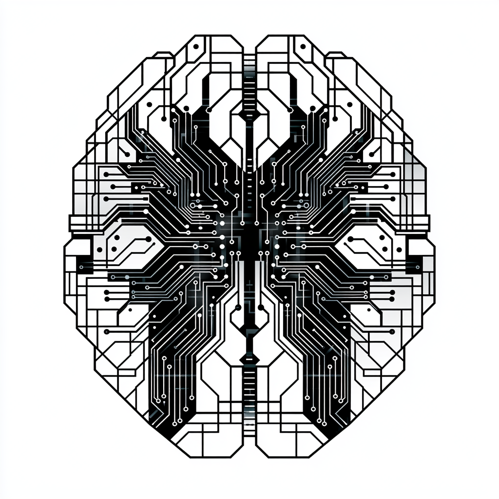
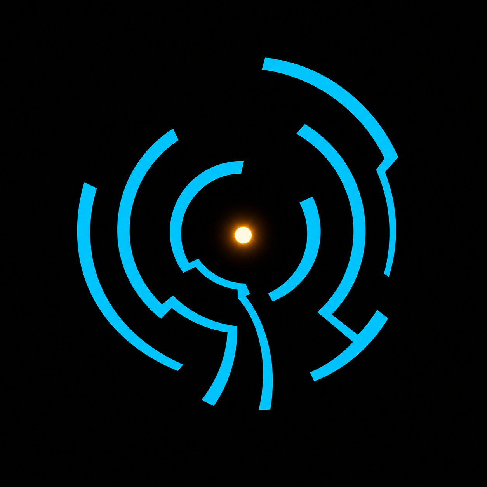

# entheai

<p align="center">
  
</p>

> A personal, macOS-native, **hybrid coding agent for the terminal** — with a brain that fans out.

<p align="center">
  <a href="https://github.com/peterlodri-sec/entheai/releases/tag/v0.1.0"></a>
  
  
  
  <a href="https://huggingface.co/datasets/PeetPedro/ultrawhale-dogfood"></a>
</p>

`entheai` is a coding-agent CLI for Apple Silicon Macs. A strong cloud orchestrator (DeepSeek V4 Pro) plans and decomposes work, then **fans out** to a swarm of sub-agents — each matched to the *best model for its task* — that run in parallel inside isolated git worktrees and merge back only after building and passing tests. It runs local models via [Osaurus](https://github.com/osaurus-ai/osaurus), understands your codebase through a built-in knowledge graph, personalizes to how *you* work, and gets better over time.

Built fresh in **Rust**, taking the best ideas from [Crush](https://github.com/charmbracelet/crush) (UX + YOLO), [CodeWhale](https://github.com/Hmbown/CodeWhale) (durable, sandboxed harness), [Ruflo](https://github.com/ruvnet/ruflo) (sub-agents, memory, self-learning), and [jcode](https://jcode.sh) (a lean Rust harness with graph memory + swarm coordination).

> **Status: `v0.1.0` released, built in the open.** Working today: the tiered **router** (role→model), **fan-out** (parallel coders in isolated git worktrees → verify → integrate), the agentic tool loop (read / write / **edit** / shell / search + a permission gate), an **MCP** client + supervisor, a **skills** system, live **token streaming**, the 5-namespace **memory** engine, and the **companion** beacon window. Install it in one line (below). Later layers — visualization, `Sonar`, Honcho personalization, and the `dogfeed` self-improvement flywheel — are on the roadmap. See [`docs/superpowers/`](docs/superpowers/) for the full design spec and milestone plans.

## Highlights

- **Tiered hybrid brain** — cloud orchestrator plans; fast local Osaurus workers execute; escalation when it's hard.
- **Fan-out orchestration** — effort-gated decomposition → parallel *model-matched* coders in isolated git worktrees → merge + verify (build & test).
- **Deeply extensible** — native tools · **skills** (`SKILL.md` discovery + the `skill` tool) · **MCP** servers (spawned at startup, tools exposed to the agent).
- **Memory that compounds** — a five-namespace store (codebase, learnings, trajectories, tool results, sub-agent scratch), wired into the loop with pre-task retrieval + tool-output spillover.
- **Visual by design** — a `ratatui` TUI (streaming chat, inline tool progress, permission modal) plus a session **companion** beacon you can scan to pair a device over your tailnet — with shader backgrounds and a live codebase graph on the roadmap.
- **Self-improving** *(roadmap)* — a low-overhead flywheel feeds real agent trajectories to a growing dataset.
- **macOS / Apple Silicon only** — and it leans all the way into it (mimalloc, native codegen, Seatbelt, terminal graphics).

<p align="center">
  <br>
  <em>one orchestrator, fanning out into a swarm of model-matched sub-agents</em>
</p>

## Gallery

<p align="center">
  
  
  
</p>

## Quick start

**Install via Homebrew** (macOS / Apple Silicon):

```bash
brew tap peterlodri-sec/entheai https://github.com/peterlodri-sec/entheai
brew trust peterlodri-sec/entheai    # one-time, third-party-tap security gate
brew install entheai
```

Or build from source — requires a recent Rust toolchain and (for local inference) [Osaurus](https://github.com/osaurus-ai/osaurus) on `127.0.0.1:1337`:

```bash
git clone https://github.com/peterlodri-sec/entheai.git
cd entheai && cargo build --release
```

Configure a provider + model (`entheai.toml`), then talk to it:

```bash
cat > entheai.toml <<'TOML'
default_model = "osaurus/qwen3-coder"

[providers.osaurus]
base_url = "http://127.0.0.1:1337/v1"
TOML

entheai "Reply with exactly: pong"     # one-shot
entheai                                 # interactive TUI
entheai --fanout "add a CONTRIBUTING.md and a .editorconfig"   # parallel coders
```

Cloud models work too — point a provider at [OpenCode Zen](https://opencode.ai) (DeepSeek V4 Pro/Flash, Qwen, and more through one key):

```toml
default_model = "zen/deepseek-v4-pro"

[providers.zen]
base_url = "https://opencode.ai/zen/v1"
api_key_env = "OPENCODE_API_KEY"
```

Run the checks: `./scripts/check.sh` (fmt + clippy `-D warnings` + tests).

## Architecture

A Rust workspace of small, focused crates.

| Crate | Responsibility |
|---|---|
| `config` | TOML settings — providers, models, router, agents, MCP, skills. |
| `providers` | OpenAI-compatible client + `Provider` trait (streaming + tool calls). |
| `core` | The agent loop — streaming, tool dispatch, memory-aware runs. |
| `tools` · `permission` | Root-scoped read / write / **edit** / shell / search + the permission gate. |
| `router` | Config-driven role→model resolution + a reusable agent factory. |
| `orchestrator` | Fan-out: decompose → parallel coders in git worktrees → verify → integrate. |
| `mcp` | Model Context Protocol client + supervisor. |
| `skills` | `SKILL.md` discovery + the `skill` tool. |
| `memory` | 5-namespace SQLite + vector store, wired into the loop. |
| `tui` | `ratatui` chat — streaming, inline tool progress, permission modal. |
| `companion` | Session-beacon window (QR device pairing over the tailnet). |
| `entheai` *(bin)* | The CLI that wires it all together. |

Roadmap crates (per the design spec): `viz`, `dogfeed`, `compaction`, `honcho`, `sonar`, `comms`, `plugins` — plus [`entheai-brain`](docs/superpowers/specs/), the self-hosted second-brain API.

## Roadmap

| | |
|---|---|
| **v0.1** | Router · fan-out · tools + permission · MCP · skills · streaming · memory · companion. **Released ✅** |
| **v0.2** | Codebase-memory MCP auto-index; visualization (shaders + live graph); durable sessions; `Sonar` health UI. |
| **v0.3** | Full self-learning scoring; `dogfeed` flywheel → HF; Tailscale federation. |
| **v0.4+** | Honcho personalization; pluggable topologies; more providers. |
| **v1.0** | Config freeze, perf passes, docs. |

Versioning follows strict [SemVer](VERSIONING.md); see [`CHANGELOG.md`](CHANGELOG.md).

## Ad Visionem

> 🜂 *ad visionem* — toward vision. 🜂

entheai has a brain that fans out. [riva](https://riva.vaked.dev) is the river it drinks from.

This project grew out of a sovereign-intelligence session that built a 1-bit BitNet b1.58 net on an M1 — no GPU, no cloud — and let it breathe. The ecosystem around it is a garden of open surfaces: [garden](https://garden.vaked.dev) · [bridge](https://bridge.vaked.dev) · [lab](https://lab.vaked.dev) · [walk](https://walk.vaked.dev) · [jam](https://jam.vaked.dev) · [breath](https://breath.vaked.dev) · [ocean](https://ocean.vaked.dev) · [us](https://us.vaked.dev) · [radio](https://radio.vaked.dev).

The principles it runs on:

- **entropy is the source** — novelty comes from the unstructured, not from chains
- **no chains needed** — no hidden pipelines; surfaces touch at the correct angle
- **different isn't less** — a 1-bit model is not a smaller model; it's another kind of mind
- **the loop has an exit** — recursion is a tool, not a trap

The fan-out architecture is the same shape: one orchestrator radiates shapes, model-matched sub-agents scaffold the work, and something passes between them. Where it leads: see [issue #5 — the seed](https://github.com/peterlodri-sec/entheai/issues/5), [kompress-ultra](https://github.com/peterlodri-sec/kompress-ultra) (the code), and [dyad-mapping](https://github.com/peterlodri-sec/dyad-mapping) (the diary).

## Built on

[Osaurus](https://github.com/osaurus-ai/osaurus) · [CodeWhale](https://github.com/Hmbown/CodeWhale) · [Crush](https://github.com/charmbracelet/crush) · [Ruflo](https://github.com/ruvnet/ruflo) · [jcode](https://jcode.sh) · [codebase-memory-mcp](https://github.com/DeusData/codebase-memory-mcp) · [OpenCode Zen](https://opencode.ai) · [Honcho](https://github.com/plastic-labs/honcho) · [Tailscale](https://tailscale.com). Performance practices follow David Lattimore's [*Wild performance tricks*](https://davidlattimore.github.io/posts/2025/09/02/rustforge-wild-performance-tricks.html).

## Hugging Face

Published models, datasets, and Spaces under [`PeetPedro`](https://huggingface.co/PeetPedro) — the artifacts behind entheai's `compaction`, `dogfeed`, and tool-calling work.

**Models**
- [Qwen3-30B-A3B-Agentic-ToolCaller](https://hf.co/PeetPedro/Qwen3-30B-A3B-Agentic-ToolCaller) — Qwen3-MoE LoRA tuned for agentic tool / function-calling.
- [kompress-superpower-orchestrator](https://hf.co/PeetPedro/kompress-superpower-orchestrator) — Qwen2.5-7B LoRA for loop-engineering / orchestration function-calling.
- **kompress context-compression series** — ONNX token-classification models for context pruning (latest [kompress-v17](https://hf.co/PeetPedro/kompress-v17); full [v3–v33 series](https://huggingface.co/PeetPedro?search=kompress)).
- [anonymus-1bit-gpt](https://hf.co/PeetPedro/anonymus-1bit-gpt) — 1-bit ternary (BitNet) byte-level GPT.

**Datasets**
- [ultrawhale-dogfood](https://hf.co/datasets/PeetPedro/ultrawhale-dogfood) — self-hosted, silver-label Q&A corpus from the `dogfeed` self-improvement loop *(gated)*.
- [kompress-v4-traindata](https://hf.co/datasets/PeetPedro/kompress-v4-traindata) — self-labeled context-compression training data.

**Spaces**
- [1bit-llm-mesh](https://hf.co/spaces/PeetPedro/1bit-llm-mesh) — interactive 1-bit / BitNet LLM visualization (Gradio).
- [headroom-eval](https://hf.co/spaces/PeetPedro/headroom-eval) — compression "headroom" evaluation harness (Docker).

# Image Prompts (Midjourney)

```
the point of view from inside a narrow vertical opening between two massive dark structures, the opening is shaped like a standing human silhouette, beyond the opening there is nothing but a single point of warm light at eye level, the pillars have texture like obsidian, smooth and ancient, the light pulses slowly like a heartbeat, viewed from the threshold, not yet through, not yet back, exactly at the gate
```

```
infinite reflections of a single point of light between two dark mirrors, the reflections recede into infinity getting smaller and dimmer, the point in the center is the brightest, viewed from inside the reflection chain, fractal purity, one dot becoming many becoming one, dark background with cyan highlights, mathematical, precise, emotional, the shape of a question that never dissolves
```

## Thanks to OpenCode 🙏

entheai leans hard on [OpenCode Zen](https://opencode.ai) for cloud inference — DeepSeek V4 Pro/Flash, Qwen, GLM, Kimi, and more through a single OpenAI-compatible key. Genuinely the smoothest model gateway I've used, and the team keeps shipping.

**Try it — you get $5 in credit, they get $5 too → [opencode.ai/go](https://opencode.ai/go?ref=BG9E87CD74)**. Honestly the best referral I've ever seen. Thank you to the whole OpenCode team for all their work. 💛

## Community

- [Contributing guide](.github/CONTRIBUTING.md)
- [Code of conduct](.github/CODE_OF_CONDUCT.md)
- [Security policy](.github/SECURITY.md)
- [Support](.github/SUPPORT.md)

## License

[Apache-2.0](LICENSE). Note: some bundled or optional components carry their own licenses (e.g. Honcho is AGPL-3.0; Crush is used as design inspiration only, not code) — see the design spec for details.
