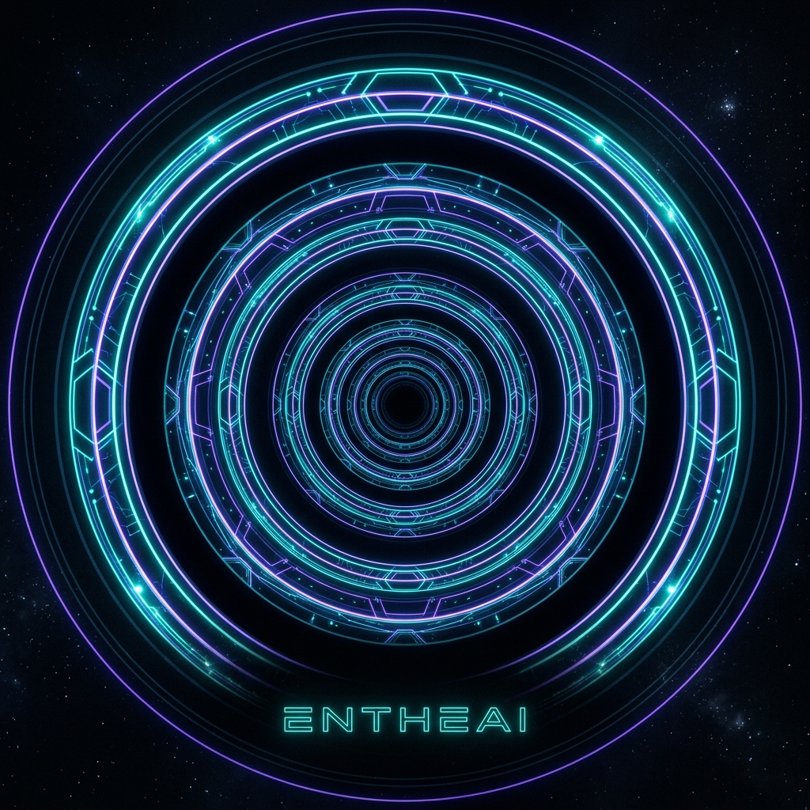
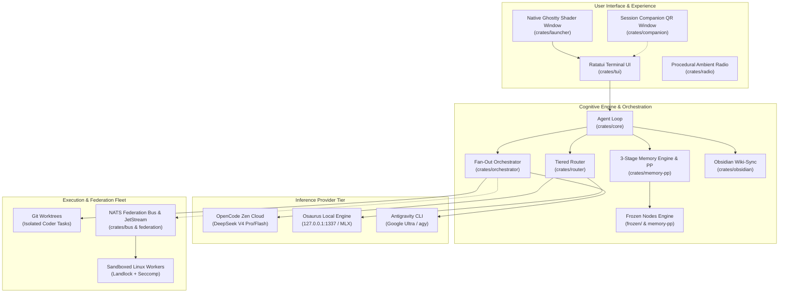
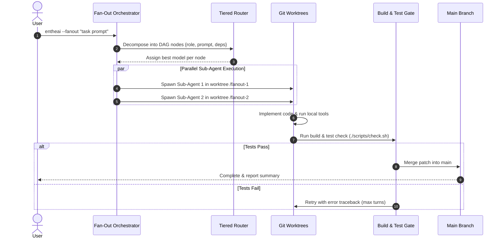
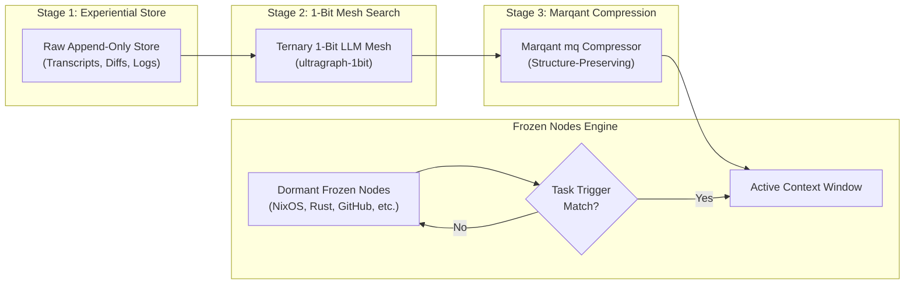
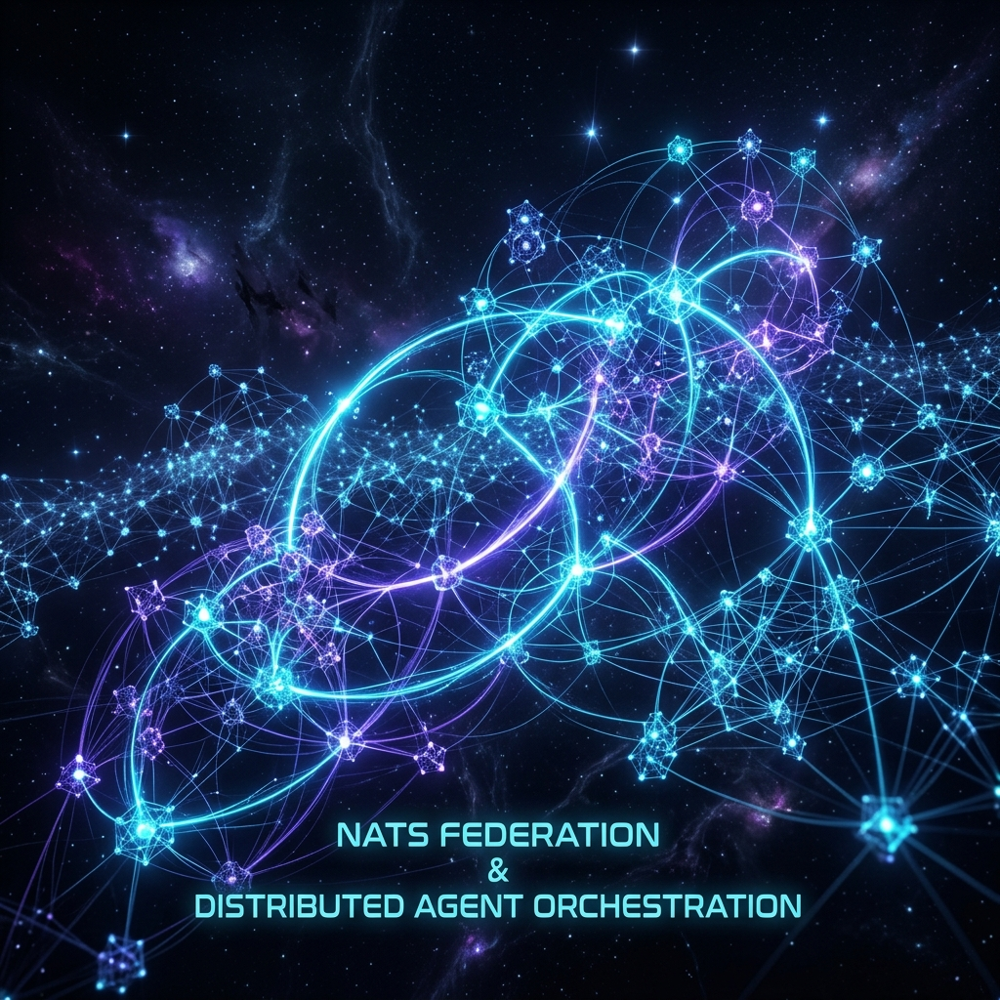
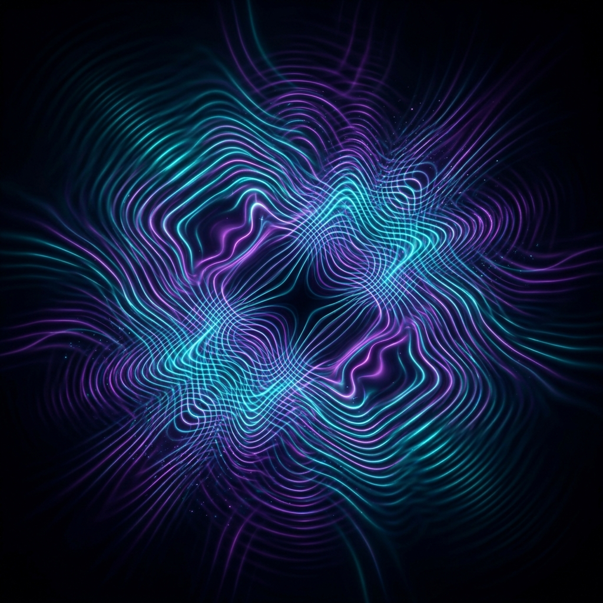

# Comprehensive Architecture Documentation

`entheai` is a macOS-native, hybrid coding agent CLI built as an optimized Rust workspace. It combines a strong cloud orchestrator, fast local inference, parallel fan-out sub-agent swarms in isolated git worktrees, prompt-processing memory, deterministic frozen nodes, and distributed NATS worker federation.

---

## 1. High-Level Architecture Overview

<p align="center">
  
</p>

The system operates across three main layers: **User Interface & Controls**, **Orchestration & Cognitive Engine**, and the **Execution & Federation Fleet**.



---

## 2. Workspace Crate Map

The repository is structured as a modular Rust workspace (resolver v2) of single-responsibility crates:

```
Cargo.toml                          # Workspace root (resolver=2)
├── bin/entheai/                    # Primary CLI binary (clap, tokio, ratatui, mimalloc)
├── bin/entheai-worker/             # Federation worker / dispatcher (--serve / --dispatch)
├── bin/entheai-launch/             # Native .app executable launching Ghostty window
├── crates/config/                  # TOML settings & Config deserialization
├── crates/core/                    # adk-rust-backed agentic loop (EntheaiAgent), streaming, tool-dispatch
├── crates/router/                  # Role-to-model resolution + agent factory
├── crates/orchestrator/            # Fan-out decomposition, git worktree isolation & merge
├── crates/mapper/                  # Text & @{path} file input sectioning and chunking
├── crates/tools/                   # Built-in sandboxed tools (read_file, write_file, search, run_shell)
├── crates/permission/              # Security policy (YOLO / allowlist / interactive prompter)
├── crates/mcp/                     # Model Context Protocol client & server supervisor
├── crates/skills/                  # SKILL.md discovery + web installer (--skills add <url>)
├── crates/memory/                  # 5-namespace SQLite + vector storage
├── crates/memory-pp/               # 3-Stage Prompt-Processing & Frozen Nodes engine
├── crates/tui/                     # Interactive ratatui terminal interface with streaming
├── crates/viz/                     # Live ASCII swarm graph renderer during fan-out
├── crates/launcher/               # Native window launcher & Ghostty rain-on-glass shader installer
├── crates/obsidian/                # Per-session wiki-sync of codebase to Obsidian vault
├── crates/bus/                     # Federation Event Bus (F1) streaming over NATS
├── crates/federation/              # Distributed Swarm (F2) JetStream queue & git-bundle transport
├── crates/radio/                   # Ambient audio engine — one bundled track, looped
├── crates/tts/                     # OS-native voice output for assistant responses (/speak)
└── crates/companion/               # Floating 180x180 session QR beacon window
```

---

## 3. The Tiered Hybrid Brain

<p align="center">
  
  
</p>

`entheai` allocates compute resources intelligently across three tiers based on task complexity:

| Compute Tier | Provider | Primary Models | Role & Responsibilities |
|---|---|---|---|
| **Cloud Orchestrator** | OpenCode Zen (`https://opencode.ai/zen/v1`) | `zen/deepseek-v4-pro`, `zen/qwen3-max` | High-level planning, DAG task decomposition, architectural decisions, and edge-case resolution. |
| **Model-Matched Coders** | OpenCode Zen / Antigravity | `zen/deepseek-v4-flash`, `zen/qwen3-coder`, `agy` | Rapid sub-agent code implementation inside isolated git worktrees. |
| **Local Low-Latency** | Osaurus (`http://127.0.0.1:1337/v1`) | `osaurus/qwen3-coder`, local embeddings | Offline tasks, rapid code inspection, privacy-sensitive runs, and local embedding generation. |

---

## 4. Fan-Out Swarm & Recursive Development



### Recursive Development (`agy` integration)
When `[fanout] executor = "agy"` is configured:
1. Every fan-out sub-agent spawns an **Antigravity CLI** process inside its dedicated git worktree.
2. Google Antigravity agents execute using Ultra-tier reasoning models.
3. Execution depth is guarded by `ENTHEAI_FANOUT_DEPTH <= 3` to prevent infinite recursion traps.

<p align="center">
  
</p>

---

## 5. Prompt-Processing & Frozen Nodes Engine (`crates/memory-pp`)

Rather than prematurely compressing conversation history into lossy vector embeddings, `entheai` utilizes a **3-stage prompt-processing pipeline** combined with **frozen nodes**:



### The Frozen Nodes Concept ("Ice in Coca-Cola")
* Domain best-practices sit dormant as Markdown units in [`frozen/`](file:///Users/peter.lodri/workspace/peterlodri-sec/entheai/frozen).
* When a task triggers a keyword (e.g. `nixos`, `hetzner`, `ssh`), the `nixos.md` frozen node wakes up and dissolves into active context.
* Like ice in Coca-Cola, it melts into the context without overflowing or bloating total capacity.

#### Curated Anchors:
* **Cloud Infrastructure**: [NixOS](nixos.org) + Flakes ([`frozen/nixos.md`](file:///Users/peter.lodri/workspace/peterlodri-sec/entheai/frozen/nixos.md))
* **Version Control**: [GitHub](github.com) CI Gate ([`frozen/github.md`](file:///Users/peter.lodri/workspace/peterlodri-sec/entheai/frozen/github.md))
* **Parallel Backends**: [Rust](rust-lang.org) & [Go](go.dev) ([`frozen/rust.md`](file:///Users/peter.lodri/workspace/peterlodri-sec/entheai/frozen/rust.md))
* **Quick Devsite Tunneling**: [ngrok](ngrok.com) ([`frozen/ngrok.md`](file:///Users/peter.lodri/workspace/peterlodri-sec/entheai/frozen/ngrok.md))
* **Scripting**: [Python + JIT](python.org) / [uv](github.com/astral-sh/uv) ([`frozen/python-jit.md`](file:///Users/peter.lodri/workspace/peterlodri-sec/entheai/frozen/python-jit.md))
* **Academic Literature**: [Valyu MCP](valyu.ai) ([`frozen/valyu.md`](file:///Users/peter.lodri/workspace/peterlodri-sec/entheai/frozen/valyu.md))

---

## 6. NATS Federation & Sandboxed Worker Network

<p align="center">
  
</p>

`entheai` features a 4-level opt-in federation pipeline over [NATS](https://nats.io) and [Tailscale](https://tailscale.com):

1. **F1 (Event Bus Streaming)**: Publishes fan-out step updates to `entheai.fanout.<session>.*` over NATS.
2. **F2.1 (Distributed Work-Queue)**: JetStream queues dispatch sub-agent tasks to remote worker nodes across the tailnet using git-bundle object transport.
3. **F2.2 (Fan-Out Offloading)**: Automatically offloads heavy coder sub-tasks to remote fleet nodes (`entheai-worker --serve`).
4. **F2.3 (Sandboxed Worker Runtime)**: Remote execution is confined by **Landlock** filesystem jails, **seccomp** syscall filters, and root privilege dropping on Linux.

---

## 7. Ambient Radio (`crates/radio`)

`entheai-radio` loops one bundled track directly inside the TUI without blocking the main event loop:

* **Audio Engine**: `rodio` on a dedicated OS thread, decoding an `include_bytes!`-embedded mp3 — no network fetch, no external tool, no cache directory.
* **The track**: "Standing-Onde" by 8bit-Wraith (<https://soundcloud.com/8bit-wraith/standing-onde>).
* **Non-Stop Playback**: loops the track indefinitely, emitting a loop counter (`NowPlaying { loop_count }`) each time it restarts.
* **Slash Commands**: `/radio pause`, `/radio next` (restart from the beginning), `/radio stop`.

---

## 8. Ecosystem Integrations & Open Surfaces

<p align="center">
  
  
</p>

`entheai` is part of a broader sovereign-intelligence garden:

* **[rustybox.io](https://rustybox.io)** — 100% Rust-native BusyBox/Coreutils userland (zero C code).
* **[vaked-base](https://github.com/peterlodri-sec/vaked-base)** — Sovereign base OS & tool definitions.
* **[pocoo.vaked.dev](https://pocoo.vaked.dev)** — Foundational architecture essays & research notes.
* **[riva.vaked.dev](https://riva.vaked.dev)** — Stream knowledge ingestion.
* **[PeetPedro Hugging Face](https://huggingface.co/PeetPedro)** — Model checkpoints, `ultrawhale-dogfood` dataset, and compression evaluation spaces.

---

## 9. Detailed Specifications & Design Documents

For deep-dive specifications on individual architectural components, consult the documents in [`docs/superpowers/specs/`](specs/):

* [Hybrid Coding Agent Core Spec](specs/2026-07-18-entheai-hybrid-coding-agent-design.md)
* [Companion Session Beacon Spec](specs/2026-07-18-entheai-companion-design.md)
* [Prompt-Processing & 1-Bit Mesh Spec](specs/2026-07-22-prompt-processing-design.md)
* [Frozen Nodes Architecture Spec](specs/2026-07-22-frozen-nodes-design.md)
* [Rustybox Sandboxed Worker Spec](specs/2026-07-22-rustybox-workers-design.md)
* [ADK Rust Core Migration Spec](specs/2026-07-22-adk-rust-core-migration-design.md)
